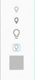

# Introduction

This package provides simple, customizable icon checkboxes

# Usage

It can be used similar to a normal checkbox.
```
IconCheckbox(
    checkedIcon: Icons.lightbulb_outline,
    uncheckedIcon: Icons.lightbulb_outline_rounded,
    value: isChecked,
    onChanged: (value) {
        setState(() {
          isChecked = value;
        });
    },
)
```

That will generate this:


# Customize

It can be customized and implemented as follows



# Properties

**checkedIcon** → IconData  
The Icon to use for the check icon when this checkbox is checked.

**uncheckedIcon** → IconData?  
The Icon to use for the uncheck icon when this checkbox is unchecked.

**value** → bool  
Whether this checkbox is checked.

**onChanged** → ValueChanged<bool>  
Called when the value of the checkbox should change.

**checkColor** → Color?
The color to use for the check icon when this checkbox is checked.

**unCheckColor** → Color?
The color to use for the uncheck icon when this checkbox is unchecked.

**boxdecoration** → BoxDecoration?  
If you implement a frame for a checkbox,Customize that frame

**iconSize** → double?  
size of the icon

**boxHeight** → double?  
height of the frame

**boxWidth** → double?  
width of the frame


